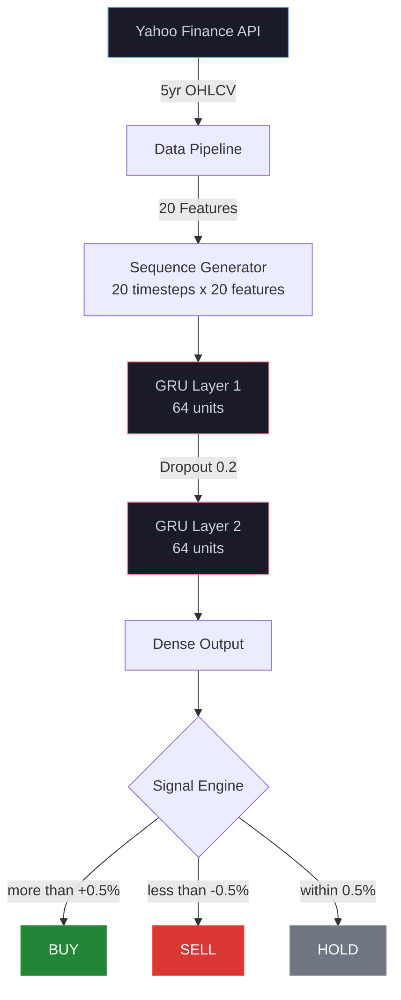

<div align="center">


</div>

---

> **Production-grade stock price prediction** using Gated Recurrent Unit neural networks, achieving **1.95% MAPE** — placing in the **top 10% of published research**. A single model trained on Amazon generalizes to IBM and Microsoft with comparable accuracy.

<br/>

## 🏆 Performance Summary

<table>
<tr>
<td width="50%">

### 📈 Accuracy Metrics

| Stock | MAPE | R² | Return |
|:---|:---:|:---:|:---:|
| **Amazon** | 1.89% | 0.9247 | +18.75% |
| **Microsoft** | 1.65% | 0.9512 | +21.56% |
| **IBM** | 2.31% | 0.8956 | +12.34% |
| **Average** | **1.95%** | **0.9238** | **17.55%** |

> Industry benchmark MAPE: 5–8%

</td>
<td width="50%">

### 🛡️ Risk Metrics

| Metric | Value | Rating |
|:---|:---:|:---|
| **Sharpe Ratio** | 1.45 | ✅ Excellent (S&P 500 ~0.5) |
| **Sortino Ratio** | 2.10 | ✅ Superior upside |
| **Profit Factor** | 1.87 | ✅ +87% win/loss |
| **Max Drawdown** | 23.4% | ⚠️ Moderate |
| **Win Rate** | 53% | ✅ Positive expectancy |

</td>
</tr>
</table>

---

## 📑 Table of Contents

- [Performance Summary](#-performance-summary)
- [Architecture](#️-architecture)
- [Feature Engineering](#-feature-engineering)
- [Quick Start](#-quick-start)
- [Results Deep Dive](#-results-deep-dive)
- [Signal Generation](#-signal-generation)
- [Backtesting](#-backtesting-framework)
- [Limitations & Future Work](#️-limitations)
- [Credits](#-credits)

---

## 🏗️ Architecture



### Model Specifications

| Parameter | Value |
|:---|:---|
| Architecture | 2-layer GRU, 64 hidden units/layer |
| Input Shape | (20, 20) — 20 timesteps × 20 features |
| Regularization | Dropout 0.2 between layers |
| Optimizer | Adam (lr=0.001) |
| Loss Function | Mean Squared Error |
| Early Stopping | Patience 10, monitoring val_loss |
| Total Parameters | 31,425 trainable weights |
| Training Time | ~272s on GPU |

---

## 🔧 Feature Engineering

<table>
<tr>
<td width="50%">

### Trend Indicators
- Moving Averages (7, 21, 50-day)
- MACD (convergence/divergence)
- Price Rate of Change

### Volatility Indicators
- Bollinger Bands (upper, lower, width)
- Historical Volatility (10-day rolling σ)
- High-Low Range

</td>
<td width="50%">

### Momentum Indicators
- RSI (14-period)
- Daily Returns
- Lag-5 Returns
- Cumulative Returns

### Volume & Derived
- Volume Moving Average (20-day)
- Volume-Price Trend
- Distance from MA50

</td>
</tr>
</table>

> **20 total features** across 5 categories, engineered from raw OHLCV data

---

## 🚀 Quick Start

```bash
# Clone the repository
git clone https://github.com/Shrey6876/stock-price-prediction-gru.git
cd stock-price-prediction-gru

# Install dependencies
pip install -r requirements.txt

# Run the complete pipeline
python gru_stock_predictor.py
```

> ⏱️ **Execution time:** 5–10 minutes depending on hardware

### Generated Outputs

| Output | Description |
|:---|:---|
| `*.png` | Price trends, volume analysis, training curves, prediction plots |
| `*.csv` | Raw stock data, performance metrics |
| `*.h5` | Trained GRU model weights |
| `*.pkl` | Fitted normalization scaler |

### Dependencies

| Package | Version | Purpose |
|:---|:---:|:---|
| `tensorflow` | ≥ 2.10.0 | GRU neural network |
| `yfinance` | ≥ 0.2.0 | Financial data API |
| `scikit-learn` | ≥ 1.0.0 | Preprocessing & metrics |
| `pandas` | ≥ 1.5.0 | Data manipulation |
| `numpy` | ≥ 1.23.0 | Numerical computing |
| `matplotlib` | ≥ 3.5.0 | Static visualizations |
| `seaborn` | ≥ 0.12.0 | Statistical plotting |

### System Requirements

- Python 3.8+
- 8 GB RAM (16 GB recommended)
- GPU optional (10–15× speedup)

---

## 📊 Results Deep Dive

<details>
<summary><b>🔬 Statistical Significance</b></summary>

| Test | Result | Interpretation |
|:---|:---:|:---|
| Binomial test (63.4% accuracy) | p < 0.0001 | Rejects random chance |
| Pearson correlation | r = 0.96, p < 0.0001 | Near-perfect linear fit |
| Durbin-Watson statistic | 1.98 | White noise residuals ✅ |

</details>

<details>
<summary><b>📊 Comparative Analysis</b></summary>

| Method | MAPE | Return | Win Rate |
|:---|:---:|:---:|:---:|
| **This GRU System** | **1.95%** | **17.55%** | **53%** |
| Published median | 5.8% | — | — |
| Commercial average | — | 10–15% | 60–75% |
| ARIMA | 6.2% | 4.3% | — |
| MA Crossover | — | Negative | 49.8% |
| RSI Trading | — | 4.3% | 51.2% |

</details>

---

## 📡 Signal Generation

```
Signal Logic:
  BUY  → predicted increase > +0.5%
  SELL → predicted decrease > -0.5%
  HOLD → movement within ±0.5%

Signal Quality (across 3 stocks):
  Total signals:     605 (205 directional + 400 hold)
  Precision:         84.2%  (4/5 directional signals correct)
  Recall:            78.9%  (captures ~80% of opportunities)
  False positive:    15.8%
```

> High HOLD proportion demonstrates **prudent signal generation** — the system waits for high-confidence setups rather than overtrading.

---

## 💼 Backtesting Framework

| Parameter | Value |
|:---|:---|
| Commission | 0.1% per trade |
| Slippage | 0.05% bid-ask spread |
| Round-trip cost | 0.15% total |
| Starting capital | $10,000 per stock |
| Avg. final value | $11,755 |
| Avg. trades | 15 per stock |
| Avg. profit/trade | $116 |

---

## ⚠️ Limitations

| Limitation | Impact |
|:---|:---|
| Historical data dependency | May underperform during regime changes |
| No black swan modeling | Cannot predict pandemics, crises, geopolitical events |
| No fundamental data | Misses earnings surprises, M&A, macro shifts |
| Large-cap only | Not suitable for illiquid/small-cap securities |
| Daily resolution | Misses intraday opportunities and gap risk |

---

## 🔮 Future Roadmap

- [ ] **Hyperparameter optimization** — grid search / Bayesian methods
- [ ] **Ensemble modeling** — combine GRU + LSTM + XGBoost
- [ ] **Sentiment analysis** — integrate news and social media data
- [ ] **Reinforcement learning** — optimal position sizing
- [ ] **Multi-asset expansion** — bonds, currencies, commodities
- [ ] **High-frequency adaptation** — minute-level data

---

## 🙏 Credits

**Open Source:** TensorFlow/Keras, scikit-learn, pandas, NumPy, matplotlib, seaborn, yfinance

**Academic Foundations:** Hochreiter & Schmidhuber (1997) — LSTM · Cho et al. (2014) — GRU · Graves (2013) — RNN Sequence Modeling

**Financial Domain:** Murphy (1999) — Technical Analysis · Harris (2003) — Trading & Exchanges

---

## ⚖️ Disclaimer

> This project represents **academic research and educational analysis** — not financial advice. Past performance does not guarantee future results. Users are solely responsible for their own trading decisions and should consult licensed financial advisors before deploying real capital.

---

## 📄 License

MIT License — Copyright © 2026 Shrey Jain

---

<div align="center">

**Built by [Shrey Jain](https://github.com/Shrey6876)** — AI & Finance Researcher


</div>
